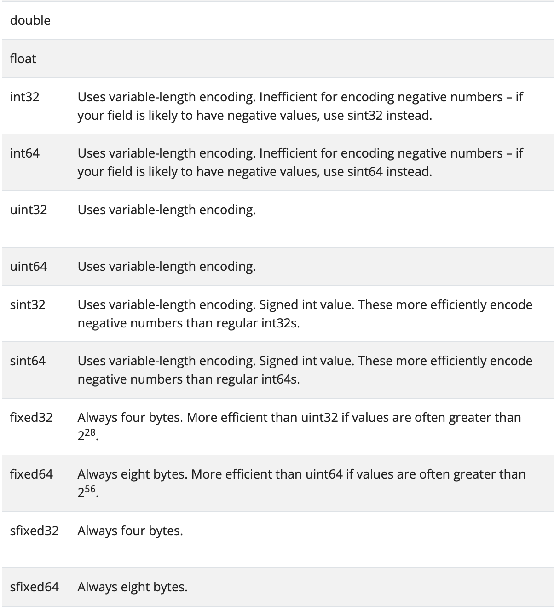

# Protocol Buffer Data Type - Scalar Type

---

- Author: Hoplin

---

## Scalar Type

- [Document](https://protobuf.dev/programming-guides/proto3/#scalar)

- Reminder: `field`에 값을 초기화 해주지 않는다면, 해당 필드는 `serialize`되지 않는다는 특성을 가지고 있다. 반대로 `deserialize`할때 기본값을 통해 반환한다.

### Number

`number`타입은 말 그대로 정수형 타입이다. protobuf에는 여러 형태가 존재한다.



각각의 다른점은 나중에...
//TODO

`numbers` 타입의 default value는 `0`이다.

```proto
{uint32 | uint 64 | fixed32 ...etc} numberField = 1;
```

### Boolean

Boolean 타입은 참/거짓의 여부에 대한 것이며 표기는 `bool`로 표기한다. `true` 혹은 `false`의 값을 받으며 **Boolean타입의 default value는 `false`이다.(헷갈림 주의)**

```proto
bool boolField = 1;
```

### String

String타입은 문자열을 받으며 표기는 `string`으로 표기한다. 문자열 값을 받으며 String타입의 default value는 빈 문자열(`""`)이다. **String타입과 관련하여 중요한 점은 `UTF-8` 혹은 `7-bit ASCII` encoded string만 받는다는 것이다**

```proto
string stringField = 1;
```

### Bytes

Bytes타입은 `bytes`로 표기한다. Byte Sequence를 받으며 Bytes타입의 default value는 빈 바이트(`b''`)이다.

**주의할 점은 bytes의 값은 프로그래밍 언어에서 해석을 직접 해야한다는 점이다. 예를 들어 이미지 데이터를 bytes로 Encoding하여 전송을 하였다면 수신을 받은 측에서는 원본 데이터의 포맷에 맞게(eg. `.png`, `.jpeg`...etc) byte 데이터를 변형해 주어야 하는것이다.**

```proto
bytes byteField = 1;
```

### 간단 연습

은행 계좌에 대한 `message`인 `Account`를 작성해보자. `Account`안에는 아래 필드가 요구된다. 요구조건에 맞는 `message`를 정의해보자.

- 사용자의 ID
- 사용자의 이름
- 사용자의 잔고
- 사용자의 대출 여부
- 사용자의 프로필 이미지

```proto
syntax = "proto3";

message Account {
    string id = 1;
    string name = 2;
    uint64 balance = 3;
    bool hasLoan = 4;
    bytes profileImage = 5;
}
```
