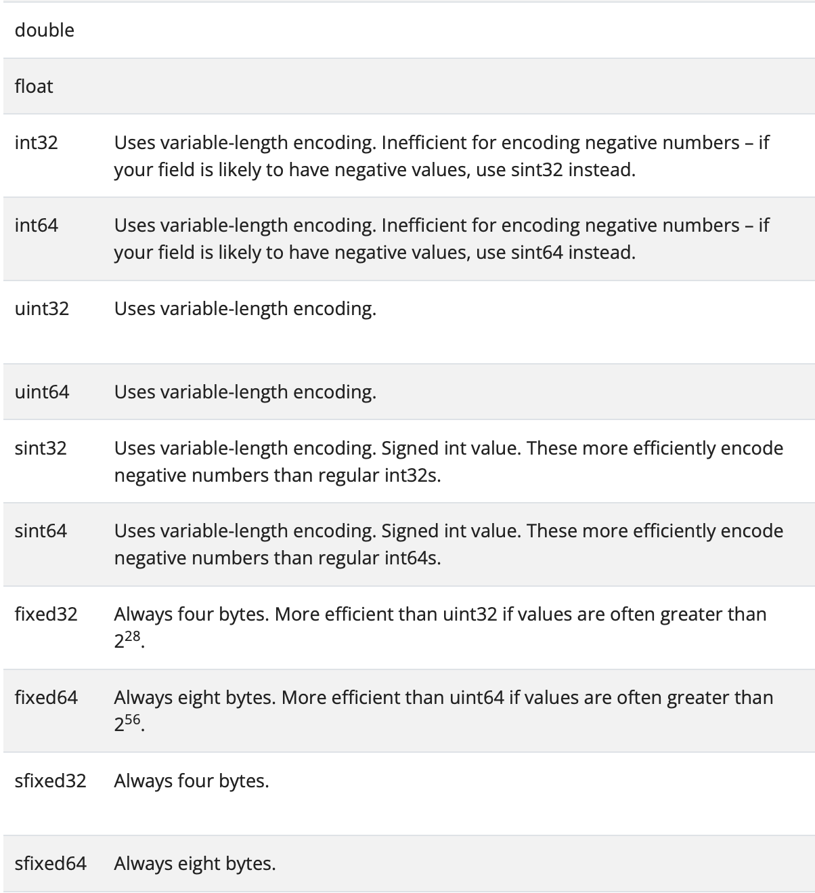
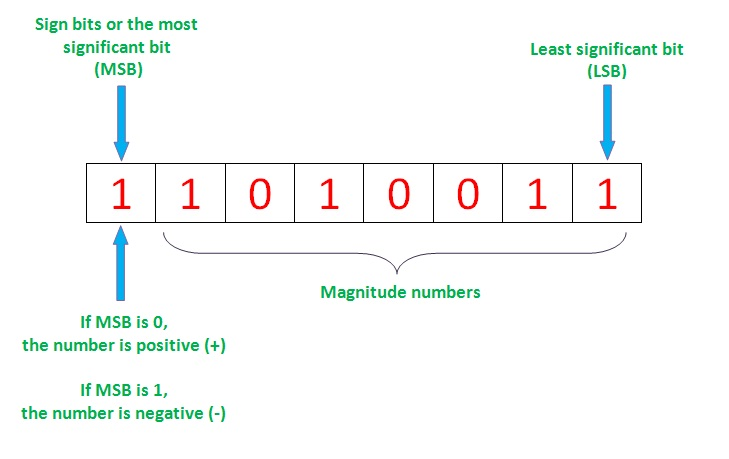
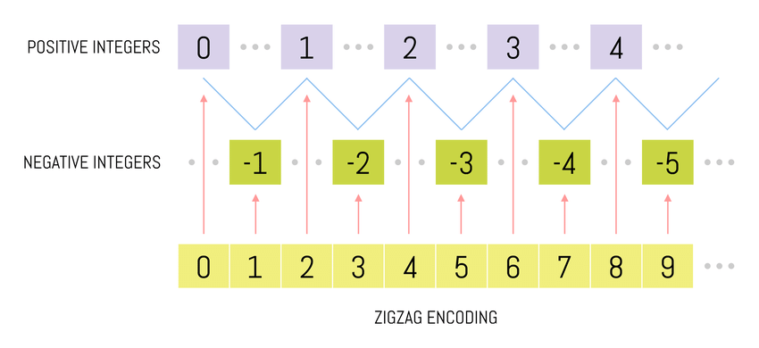

# Protocol Buffer Data Type - Scalar Type

---

- Author: Hoplin

---

## Scalar Type

- [Document](https://protobuf.dev/programming-guides/proto3/#scalar)

- Reminder: `field`에 값을 초기화 해주지 않는다면, 해당 필드는 `serialize`되지 않는다는 특성을 가지고 있다. 반대로 `deserialize`할때 기본값을 통해 반환한다.

### Number

`number`타입은 말 그대로 정수형 타입이다. protobuf에는 여러 형태가 존재한다.



`numbers` 타입의 default value는 `0`이다.

```proto
{uint32 | uint 64 | fixed32 ...etc} numberField = 1;
```

그렇다면 각각 다른 정수형 타입을 어떻게 선택해서 사용해야할까? 기본적으로 세가지 기준으로 정할 수 있다.

#### Range: 32bit 혹은 64bit

단순히 표현할 수 있는 숫자의 범위이다.(Document 참고)

#### Signed or Unsigned

`int32`와 `int64`모두 음수를 받을 수 있다. 하지만 가급적이면 음수값이 많거나, 음수값을 표현해야하는 경우에는 `sint32` 혹은 `sint64`를 통해 표현하는것이 좋다.
이유는 `int32`혹은 `int64`를 통해서 인코딩을 하게 되면, 항상 `10byte`길이가 고정되게 된다.

`int`형의 경우에는 음수 부호를 표현하기 위해서 MSB(Most Significant Bit)가 사용되기 때문에 음수값에 대해 고정적인 `10byte`를 차지하는 것이다.



`sint`형의 경우 `ZigZag`인코딩을 사용한다. `ZigZag` 인코딩은 음수(부호가 있는 값을)가 양수(부호가 없는 값으로)가 되는 방식으로 매핑을 한다고 한다.(자세히 들여보진 않았다.) 이러한 특성으로 인해 `sint`의 경우 양수를 저장하는데 효과적이지 않다.(양수는 `int`형에 저장)



#### Varint의 여부[(이전 노트 참고)](./1.%20Protocol%20Buffer%20Basic1.md)

음수를 저장할때와 같이(10byte 고정) 불필요한 공간이 생기는 경우 `fixed` 혹은 `sfixed` 타입을 활용한다.

- `sfixed32`,`fixed32`: 항상 4byte
- `sfixed64`,`fixed64`: 항상 8byte

### Boolean

Boolean 타입은 참/거짓의 여부에 대한 것이며 표기는 `bool`로 표기한다. `true` 혹은 `false`의 값을 받으며 **Boolean타입의 default value는 `false`이다.(헷갈림 주의)**

```proto
bool boolField = 1;
```

### String

String타입은 문자열을 받으며 표기는 `string`으로 표기한다. 문자열 값을 받으며 String타입의 default value는 빈 문자열(`""`)이다. **String타입과 관련하여 중요한 점은 `UTF-8` 혹은 `7-bit ASCII` encoded string만 받는다는 것이다**

```proto
string stringField = 1;
```

### Bytes

Bytes타입은 `bytes`로 표기한다. Byte Sequence를 받으며 Bytes타입의 default value는 빈 바이트(`b''`)이다.

**주의할 점은 bytes의 값은 프로그래밍 언어에서 해석을 직접 해야한다는 점이다. 예를 들어 이미지 데이터를 bytes로 Encoding하여 전송을 하였다면 수신을 받은 측에서는 원본 데이터의 포맷에 맞게(eg. `.png`, `.jpeg`...etc) byte 데이터를 변형해 주어야 하는것이다.**

```proto
bytes byteField = 1;
```

### 간단 연습

은행 계좌에 대한 `message`인 `Account`를 작성해보자. `Account`안에는 아래 필드가 요구된다. 요구조건에 맞는 `message`를 정의해보자.

- 사용자의 ID
- 사용자의 이름
- 사용자의 잔고
- 사용자의 대출 여부
- 사용자의 프로필 이미지

```proto
syntax = "proto3";

message Account {
    string id = 1;
    string name = 2;
    uint64 balance = 3;
    bool hasLoan = 4;
    bytes profileImage = 5;
}
```
