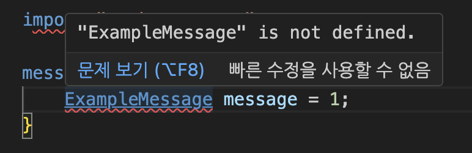

# Protocol Buffer Import & Package

---

- Author: Hoplin

---

## Import from other `.proto`

`import`를 활용하면 다른 `.proto`파일에 정의된 `message`타입 혹은 `enum`을 활용할 수 있다. `import` 키워드의 syntax는 아래와 같다

```proto
import "(protocol buffer file name).proto";
```

중요한 점은 `import`할 파일에 `.proto`확장자까지 붙여주어야 한다는 점이다.
[`import example`](./import%20example/)디렉토리를 살펴보자. `will_import.proto`파일을 보면, `will_be_imported.proto`를 `import`하는 줄을 볼 수 있다.

```proto
import "will_be_imported.proto";
```

`will_import.proto`파일에서는 `will_be_imported.proto`에 정의된 `NeedToBeImported`라는 `message`타입을 `import`를 통해 사용한다.

## Use package

여러 파일들간의 `import`를 하는 과정에서 Name Collision등의 문제가 발생할 수 도 있다. 이런 경우 `package`를 `.proto`파일에 선언하여 방지할 수 있다.(일종의 `namespace`의 느낌이다.)

`package`는 일반적은 `.proto`파일에 `package`키워드를 통해 선언하며 선언 방식은 아래와 같다.

```proto
package (package name);
```

`package`가 선언된 `.proto`파일을 사용하는 방법은 `import`를 통해 `.proto`파일을 불러오는것이 첫번째이다.

그 이후 `package`가 정의된 파일 내의 `message`타입 혹은 `enum`앞에 `package`명을 붙여서 사용하면 된다.

[`package example`](./package%20example/)디렉토리를 살펴보자. `use-package.proto`파일에서는 `package.proto`를 `import`한다.

```proto
syntax = "proto3";

import "package.proto";
```

`package.proto`파일을 살펴보면, `example.proto`라는 이름으로 `package`가 정의되어있다.

```proto
syntax = "proto3";

package example.proto;


message ExampleMessage{
    string message = 1;
}
```

앞에서 언급했듯이, `package`가 선언된 `.proto`파일의 `message`, `enum`에 대해서는 앞에서 패키지 명을 함께 붙여주어야 한다.

```proto
syntax = "proto3";

import "package.proto";

message UsePackage{
    example.proto.ExampleMessage message = 1;
}
```

만약 `package`명을 함께 붙이지 않는다면, 아래 사진과 같이 `not defined` 오류가 난다.


